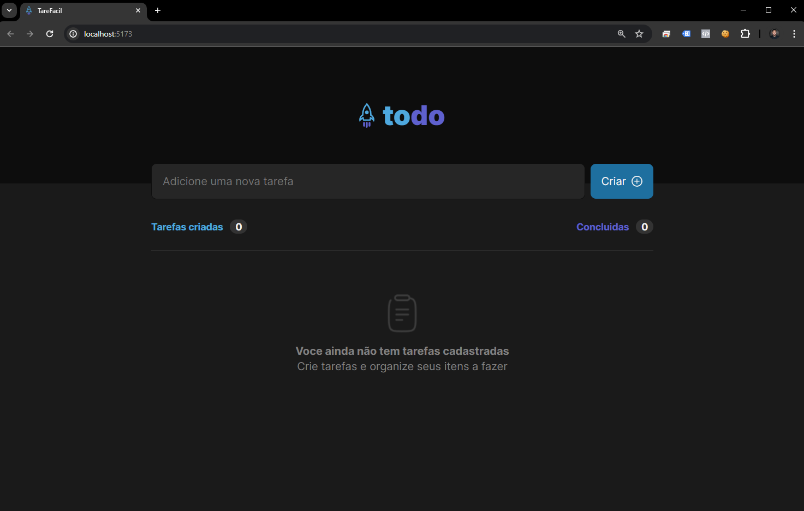
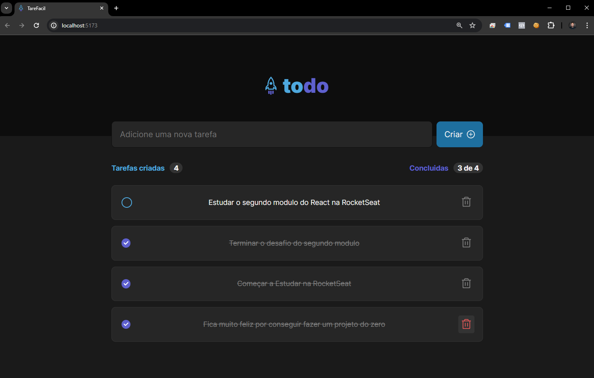

# Aplicativo de Lista de Tarefas

Este é um aplicativo simples de lista de tarefas construído com React.







## Funcionalidades

- Adicionar novas tarefas
- Excluir tarefas
- Marcar tarefas como concluídas
- Visualizar o número de tarefas criadas e concluídas

## Tecnologias Utilizadas

- React
- Módulos CSS

## Começando

Para obter uma cópia local em funcionamento, siga estas etapas simples:

1. Clone o repositório
   ```sh
   git clone https://github.com/seu_nome_de_usuario/seu_repositorio.git

2. Instale os pacotes NPM
   ```sh
   npm install

3. Execute o aplicativo
   ```sh
   npm start


## Uso

1. Insira uma tarefa no campo de entrada e pressione "Criar" para adicioná-la à lista.
2. Para marcar uma tarefa como concluída, marque a caixa de seleção ao lado dela.
3. Para excluir uma tarefa, clique no ícone de lixeira ao lado dela.
